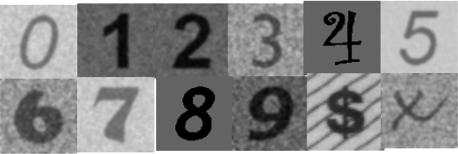

# Installing Tensorflow
I recommend installing Python and Tensorflow using [Anaconda](https://docs.anaconda.com/anaconda/user-guide/tasks/tensorflow/)
# OCR with MLP 
Let's start with an OCR example, where an MLP model is trained for classifying images like those appearing below:

## 1. Preparing the data
First of all, we need to define the training and validation datasets. In our case, both datasets can be downloaded from [here](https://www.dropbox.com/s/9sz9gu14wektmqu/OCR-12.zip). It is possible that you need to change the prefix path appearing in the files, to point out to the correct folder.
The datasets are defined through two files. The first, *train-txt*, lists all the images used for training. 
The second, *val.txt*, lists the images used for validation (or testing). You will note in the files that each image is accompanied by its corresponding label.
In this OCR example, the number of classes is 12. 

In addition, to make this explanation more straightforward, we will suppose that both files, train.txt and test.txt, are in the folder [DATA_DIR].

## 2.Feature Extraction
We will represent each image as a histogram of orientations, this will be the feature vector. To compute the feature vectors for the training dataset, you shoud run the following line:
> $ python extract_features.py -dir /home/vision/smb-datasets/OCR -mode train

You can run the same program for the validation dataset just changing the mode to *val* (-mode val). 

It is important to note that after running the line above, two new files will be created and saved in the [DAT_DIR]. The first is the feature vector file which is named with the suffix *x.pny* and the label file named with the suffix *lbl.npy*.

## 3.Defining the MLP architecture
Our architecture is an MLP consisting of two hidden layers with 128 and 64 neurons, respectively. The second layer is connected to the classification layer (with 12 neurons), whose outputs are then normalized by a softmax function. This architecture is implemented in the file [simple_mlp.py](models/simple_mlp.py).
## Training
> $ python mlp.py -dir [DAT_DIR] -mode train -n_classes 12
## Testing
> python mlp.py -dir [DATA_DIR] -mode val -n_classes 12 -ckp [DATA_DIR]/models/050.h5 

